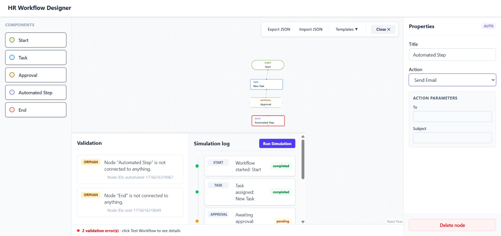
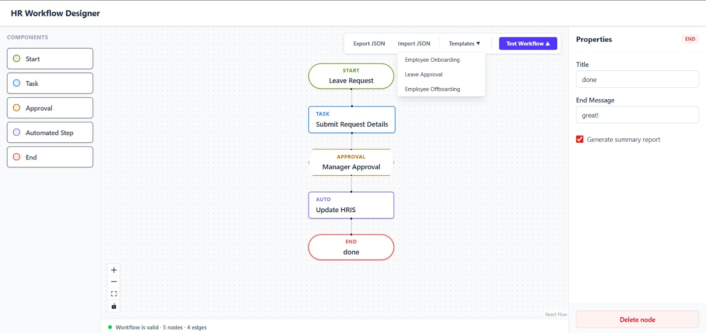

# HR Workflow Designer

A robust, interactive drag-and-drop HR workflow designer built with React 18, TypeScript, Vite, Tailwind CSS, and React Flow.

## 1. How to Run

1. **Install dependencies**:
   ```bash
   npm install
   ```
2. **Start the development server**:
   ```bash
   npm run dev
   ```
3. Open the application in your browser (usually `http://localhost:5173`). The UI automatically bootstraps with the integrated `msw` mock worker.

## 2. Architecture Overview

The system architecture is neatly scoped to separate state management, UI styling, dynamic logic, and external bindings:

- **`/src/types/`**: Single source of truth for TypeScript interfaces. Using discriminated unions (like `NodeType`) ensures React Flow generics strictly map custom nodes to their relevant payload structures.
- **`/src/store/`**: Hosts the `zustand` module. Keeping workflow graph shapes centrally accessible unblocks "prop-drilling" and lets sidebars, forms, and canvas directly access nodes/edges.
- **`/src/components/nodes/`**: Custom node templates. Handlers hook visually customized Tailwind CSS shapes to the central state pipeline.
- **`/src/components/forms/`**: Node configuration properties. A dynamic panel rendering independent functional components matching node selections.
- **`/src/components/canvas/`**: Layout algorithms wrapping `@xyflow/react`. Translates user drag coordinates to accurate workflow maps.
- **`/src/utils/`**: Pure functions. Placed separately so algorithms (like Graph Theory validation checks) avoid React lifecycle coupling.
- **`/src/api/`**: Network layer abstracting standard Fetch requests. Tied dynamically into MSW to intercept simulation operations invisibly.

## 3. Key Design Decisions

- **Why Zustand?**
  Workflow editors possess heavily mutating state. Context APIs render too deeply on arrays of nodes, but `zustand` avoids stale values using subscriptions. Node properties update cleanly alongside `@xyflow/react` event triggers.
  
- **Why MSW (Mock Service Worker)?**
  Building frontends robustly without waiting for backend schemas accelerates UI development. MSW seamlessly fakes native HTTP layer interceptions at the Service Worker level while remaining disconnected from component logic.
  
- **How Dynamic Forms Work**
  Instead of giant refs, the NodeForm properties listen and push inline modifications explicitly pointing to the generic `updateNodeData` hook on every keystroke. Since each map uses identical base interfaces with extended parameters, the forms switch via `selectedNode.type`.

- **How GraphValidator is Decoupled**
  To maintain testability, `graphValidator` takes primitive subsets (`Array<Node>`, `Array<Edge>`). By excluding React wrappers, this utility calculates paths optimally in isolation, only publishing `ValidationResult` upstream inside memoized hooks natively attached to the store pipeline.

## 4. Graph Validation Approach

The integrity of workflow executions hinges on two standard algorithmic graph mechanisms:
- **DFS Cycle Detection**: The validator builds a directed adjacency list map marking connected nodes. We employ a Recursion Stack `Set` paired with a Depth First Search (DFS). Before processing a neighbor, if we stumble into a node that exists in our current active Recursion branch footprint, a directed loop exists. It captures this array to highlight the exact visual bounds where the cycle is trapped!
- **BFS Reachability**: We want to make sure tasks are executable. We traverse a Breadth-First-Search (BFS) originating solely from the system's "Start" nodes. Expanding outwards uniformly, we document every reachable node ID. Afterwards, we sequentially ping every standalone node in the layout to ensure it's cataloged inside our "Reachable" BFS history footprint. If it's not, it's categorized as physically unreachable.

## 5. What is Complete vs. What Would Be Added With More Time

**Completed**:
- Complete Vite scaffolding with pristine `xyflow` drag-and-drop bindings.
- Distinct CSS designs per node with visual tracking features.
- Full MSW REST mock pipeline validating Automations and resolving simulated workflow pathways automatically timeline delays.
- Advanced pure math algorithms detecting orphan paths, loop iterations, reachability, and root structures in O(V+E) time constraints.
- Real-time React form states adjusting specific target properties on-the-fly.

**What would be added with more time**:
- **Undo / Redo History**: Binding a time-travel module across Zustand frames to revert properties and node removals seamlessly.
- **Rich Interactive Canvas**: Zoom constraints, edge routing tweaks (step routing algorithms vs Bezier).
- **Persistent Data**: Integrating robust backend SQL storage via Node.js instead of mocking APIs.
- **Workflow Snapshots**: Exporting the schema dynamically back into JSON standard workflows natively deployable in CI/CD platforms.

## 6. Known Tradeoffs

- **Strict Strict-Mode Enforcement**: Sometimes maintaining perfect generic interfaces forces minor structural workarounds across library wrappers like `xyflow` prop arrays natively parsing strings vs literal unions.
- **Mocking Overhead**: Using MSW dictates manual endpoint scaling when shifting to production; but separating `client.ts` abstracts this cleanly enough.
- **Multiple Endings**: Validating more than one root exit path throws a warning but allows execution. In production runtime automation schemas, split-endings potentially duplicate email bursts.

## Screenshots



